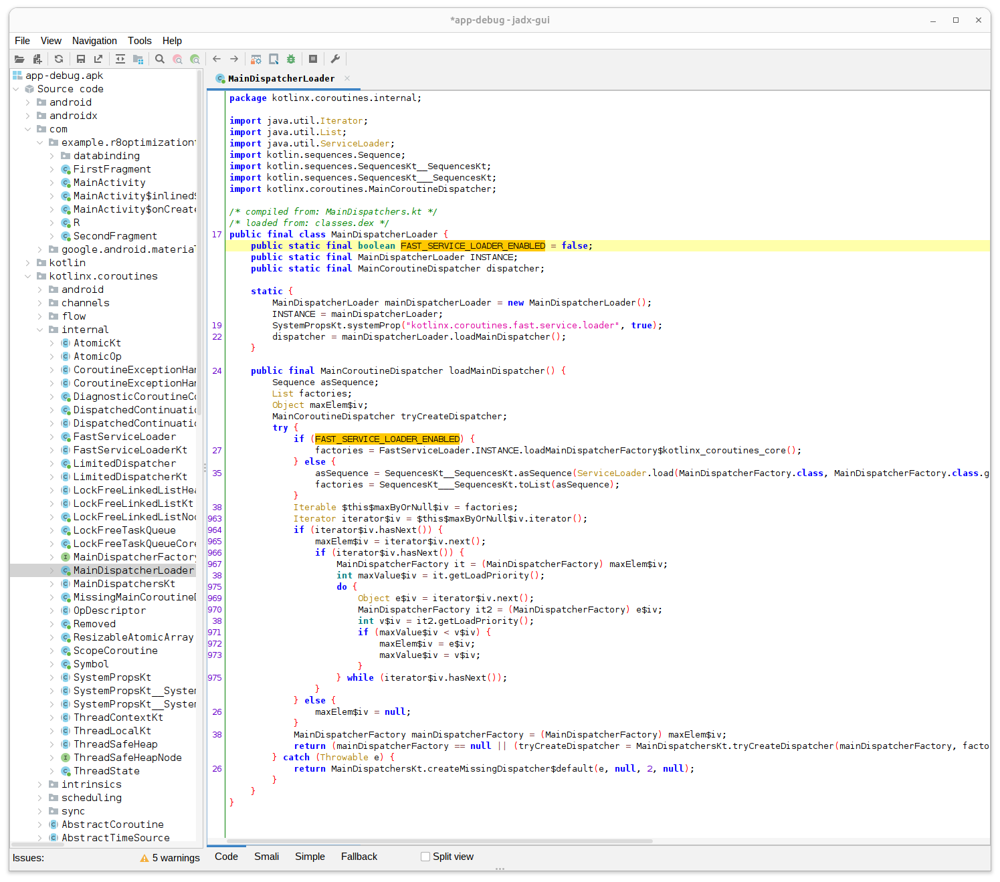

# Testing FastServiceLoader is removed by R8

This repository contains simple [kotlinx.coroutines](https://github.com/Kotlin/kotlinx.coroutines) setup with R8 optimization enabled.


## R8 version

```
8.2.33 (build b9c6a503fec02920ce801cc886c748552851b6f3 from go/r8bot (luci-r8-custom-ci-focal-4-jc7u))
```

## `proguard-rules.pro`

```
-checkdiscard class kotlinx.coroutines.internal.FastServiceLoader
```

ref.) https://github.com/Kotlin/kotlinx.coroutines/issues/1231#issuecomment-499300105


## Result

The `FastServiceLoader` class is not discarded and failed to build.

```bash
$ ./gradlew app:assembleDebug

Welcome to Gradle 8.2!

Here are the highlights of this release:
 - Kotlin DSL: new reference documentation, assignment syntax by default
 - Kotlin DSL is now the default with Gradle init
 - Improved suggestions to resolve errors in console output

For more details see https://docs.gradle.org/8.2/release-notes.html

Starting a Gradle Daemon, 1 stopped Daemon could not be reused, use --status for details

> Task :app:minifyDebugWithR8 FAILED
ERROR: R8: Discard checks failed.
The following items were not discarded
Item kotlinx.coroutines.internal.FastServiceLoader was not discarded.
kotlinx.coroutines.internal.FastServiceLoader
|- is referenced from:
|  kotlinx.coroutines.MainCoroutineDispatcher kotlinx.coroutines.internal.MainDispatcherLoader.loadMainDispatcher()
|- is invoked from:
|  void kotlinx.coroutines.internal.MainDispatcherLoader.<clinit>()
|- is reachable from:
|  kotlinx.coroutines.internal.MainDispatcherLoader
|- is referenced from:
|  kotlinx.coroutines.MainCoroutineDispatcher kotlinx.coroutines.internal.MainDispatcherLoader.dispatcher
|- is referenced from:
|  kotlinx.coroutines.MainCoroutineDispatcher kotlinx.coroutines.Dispatchers.getMain()
|- is invoked from:
|  void com.example.r8optimizationtest.MainActivity.onCreate$lambda$0(com.example.r8optimizationtest.MainActivity,android.view.View)
|- is invoked from:
|  void com.example.r8optimizationtest.MainActivity.$r8$lambda$Saf83JeRVw2uHIHLL3_OvcMEPBQ(com.example.r8optimizationtest.MainActivity,android.view.View)
|- is invoked from:
|  void com.example.r8optimizationtest.MainActivity$$InternalSyntheticLambda$1$fff7f3c7c27fbd036b74130a918d93f16f48e0eecee2ae7848de359d0928b014$0.onClick(android.view.View)
|- is defined in library method overridden by:
|  com.example.r8optimizationtest.MainActivity$$InternalSyntheticLambda$1$fff7f3c7c27fbd036b74130a918d93f16f48e0eecee2ae7848de359d0928b014$0
|- is instantiated in:
|  void com.example.r8optimizationtest.MainActivity.onCreate(android.os.Bundle)
|- is defined in library method overridden by:
|  com.example.r8optimizationtest.MainActivity
|- is referenced in keep rule:
|  /home/haruki/git/KotlinxCoroutinesR8OptimizationTest/app/build/intermediates/aapt_proguard_file/debug/aapt_rules.txt:4:1


FAILURE: Build failed with an exception.

* What went wrong:
Execution failed for task ':app:minifyDebugWithR8'.
> A failure occurred while executing com.android.build.gradle.internal.tasks.R8Task$R8Runnable
   > Compilation failed to complete

* Try:
> Run with --stacktrace option to get the stack trace.
> Run with --info or --debug option to get more log output.
> Run with --scan to get full insights.
> Get more help at https://help.gradle.org.

BUILD FAILED in 23s
32 actionable tasks: 31 executed, 1 up-to-date
```

## Decompiled code - `MainDispatcherLoader`



